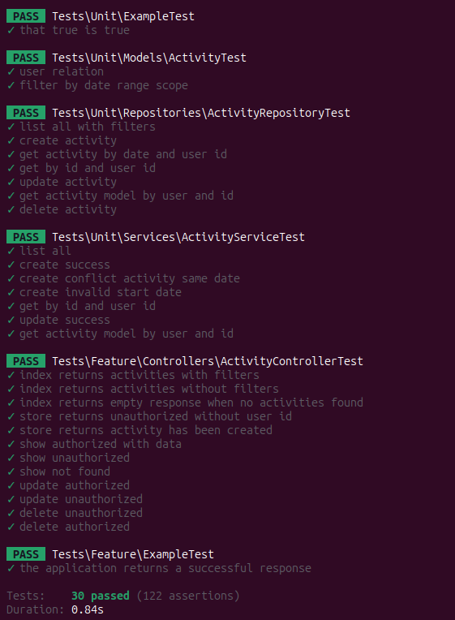

# Test Febrafar - Activity API

This guide outlines the steps to install and utilize the Activity API using Laravel Sail.

## Installation

1. Clone the project repository:
    ```bash
    git clone <repository_url>
    ```
   
2. Navigate to the project directory:
    ```bash
    cd <project_directory>
    ```
   
3. Install with composer
    ```bash
    composer install
    ```
   ```bash
   composer run post-root-package-install
    ```
   
4. Start Laravel Sail:
   ```bash
   ./vendor/bin/sail up -d
   ```
   
5. Configure the project:
   ```bash
   ./vendor/bin/sail composer run post-create-project-cmd
    ```

6. Run the seeder
    ```bash
   ./vendor/bin/sail artisan db:seed --class=ActivitySeeder
    ```
   
7. Once Sail is up and running, you can access the Activity API at `http://localhost/api`.

## Usage

1. To interact with the API, you can use tools like Postman or cURL.

2. The Swagger documentation for the API is available at:

    ```plaintext
    http://localhost/api/documentation
    ```

3. Explore the Swagger documentation to understand the available endpoints and their usage.

4. You can make requests to the API endpoints listed in the Swagger documentation using the specified parameters.

5. Ensure Laravel Sail remains running while you interact with the API.

## Running Tests

1. Run all tests inside sail container
    ```bash
   ./vendor/bin/sail artisan test
    ```
2. Result of the tests



By following these steps, you can install and utilize the Activity API with Laravel Sail. Use the Swagger documentation to understand and utilize the available endpoints effectively.
